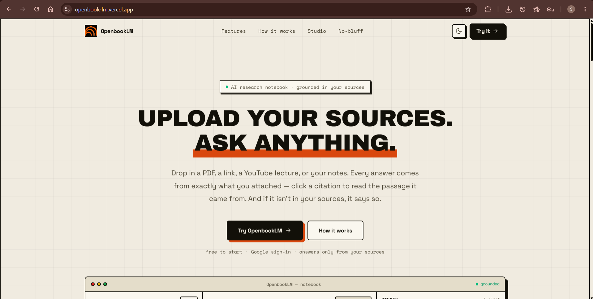
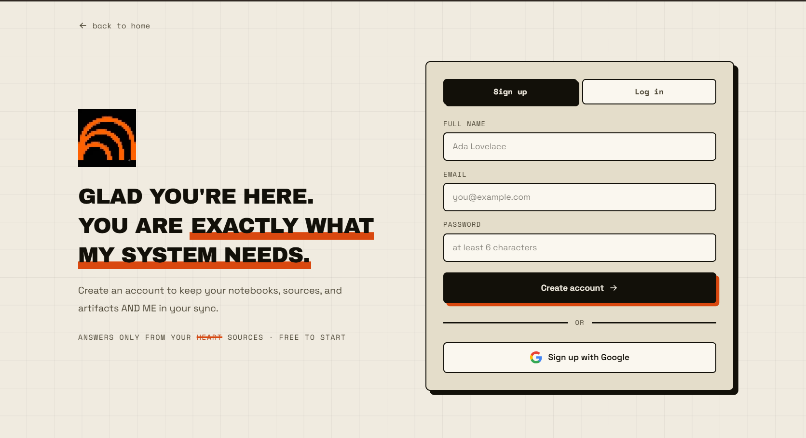
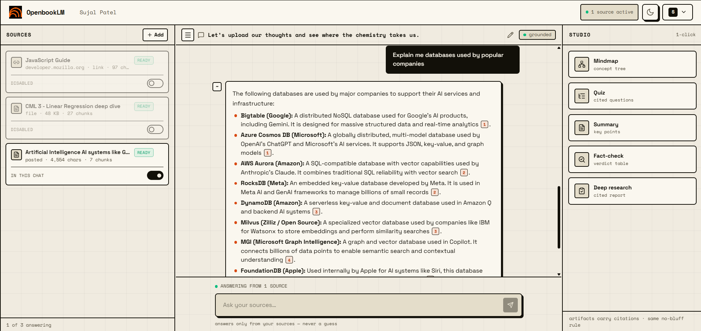
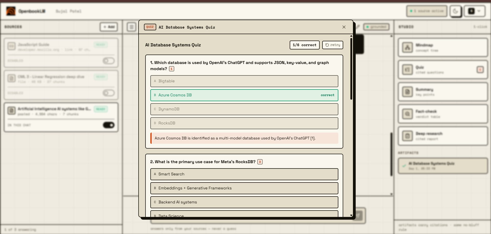
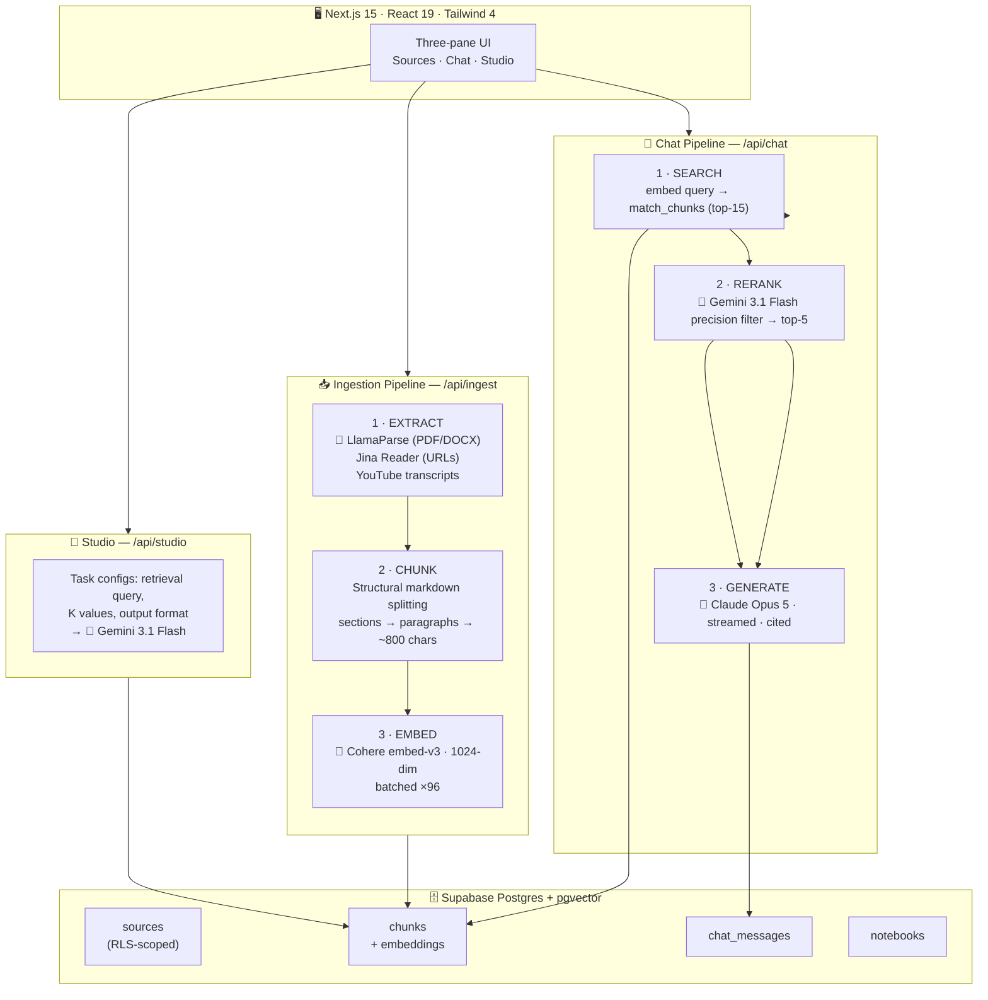

<div align="center">



# 📖 OpenbookLM

**A research workspace — grounded answers, inline citations, zero bluffing.**

Attach sources. Ask questions. Get answers generated *only* from what you attached —
every claim carries a citation, and out-of-context questions get an honest
"I don't know" instead of an invented one.

[](https://nextjs.org)
[](https://react.dev)
[](https://www.typescriptlang.org)
[](https://supabase.com)
[](https://tailwindcss.com)
[](https://cohere.com)
[](https://cloud.llamaindex.ai)
[](https://claude.com)

</div>

---

## ✨ What it does

| | |
|---|---|
| 📎 **Attach anything** | Web pages, PDFs / DOCX, YouTube videos, pasted text — each source is parsed, chunked, and embedded into a private vector index. |
| 💬 **Chat with your sources** | Answers are streamed token-by-token, built **only** from your attached material, with inline `[1]`-style citations that resolve to the exact passage. |
| 🧠 **Studio — one-click artifacts** | Mindmap, Quiz, Summary, Deep-research report, and Fact-check generated from the same index, with the same citation discipline. |
| 🚫 **The no-bluff contract** | If the sources don't cover it, the model says *"I don't know about this"* — it never fills gaps with plausible-sounding text. |
| 🔐 **Google sign-in** | One click, no passwords. Notebooks, sources, chats, and artifacts are saved server-side, scoped to your account, and enforced with Postgres row-level security. |
| 🪟 **Three resizable panes** | Sources · Chat · Studio — each drag-resizable, built for the way you actually research. |

<div align="center">

| Landing | Sign in |
|:---:|:---:|
|  |  |

| Dashboard | Notebook Studio |
|:---:|:---:|
|  |  |

</div>

---

## 🧬 The Model Orchestration

OpenbookLM doesn't use one big model for everything. It's a **cost-sane pipeline**:
a fast, cheap model runs the high-volume orchestration steps, and the heavyweight
reasoning model is reserved for where reasoning actually matters — talking to you.

| Stage | Model | Why |
|---|---|---|
| **Reranking** (precision relevance filter) | 🌟 **Google Gemini 3.1 Flash** | Judging 15 vector-search candidates against a query is a high-volume, low-stakes call — a fast thinking model does it cheaply at ~1000× lower cost per token than the frontier model. |
| **Studio artifacts** (mindmaps, quizzes, summaries, fact-checks) | 🌟 **Google Gemini 3.1 Flash** | Structured extraction and formatting over retrieved chunks — speed and JSON reliability beat frontier reasoning here. |
| **Chat generation** (the answers you read) | 🧠 **Claude Opus 5** | The main chatting model. Grounded synthesis, careful citation placement, and honest refusals are exactly what a frontier reasoning model is for. |
| **Embeddings** | 🔷 **Cohere `embed-english-v3.0`** (1024-dim) | Purpose-built retrieval embeddings, batched 96-per-request into pgvector. |
| **Document parsing** | 🦙 **LlamaParse** | Layout-aware PDF/DOCX → markdown, so tables and structure survive ingestion. |

> The split is deliberate: **Gemini 3.1 Flash orchestrates, Claude Opus 5 conversates.**
> Bulk pipeline steps never touch the expensive model, and the expensive model never
> wastes its reasoning on filtering chores.

---

## 🏗️ Architecture



### The retrieval pipeline, step by step

Every answer — chat or studio — walks the same **3-stage RAG path**:

**1 · Search.** Your question is embedded with Cohere (`search_query` mode) and
matched against the chunks of your selected sources via the `match_chunks`
Postgres function (cosine similarity, top-15).

**2 · Rerank.** Gemini 3.1 Flash receives all 15 candidates and returns **only**
the ids that are strictly relevant to the query — a precision filter that cuts
noise before it can reach the context window. If the model's reply can't be
parsed, the system degrades gracefully to similarity order; reranking is an
optimization, never a single point of failure.

**3 · Generate.** The surviving chunks are numbered, wrapped in a strict
grounded-generation prompt, and streamed to Claude Opus 5. The prompt enforces
the rules that define the product:

- Answer **only** from the numbered chunks — no outside knowledge, ever.
- Cite claims inline: `[1]`, `[2][3]`, right after the sentence they support.
- If the context doesn't cover it, **refuse** — plainly, with a suggestion of
  what to attach or ask instead.
- Never mention chunks, retrieval, embeddings, or the pipeline.

The finished answer is persisted **server-side** (with its citation chunk ids),
so a flaky browser session can never lose your history. Chunk ids ride back on
the `X-Citation-Chunk-Ids` header so the UI can render hoverable citation chips
that open the exact source passage.

### Ingestion, step by step

Adding a source triggers the background pipeline in `/api/ingest`
(`maxDuration = 300` — big PDFs take a while):

1. **Extract** — routed by source type:
   - **PDF / DOCX** → LlamaParse (upload → poll job → fetch markdown), with
     layout-aware parsing so structure survives.
   - **YouTube** → real transcript fetching with browser-like headers, timeouts,
     retries, and *actionable* failure messages ("creator disabled captions"
     vs. "YouTube is blocking this server"). A YouTube link pasted into the
     generic URL field is auto-detected and re-routed to the transcript path.
   - **URL** → Jina Reader (`r.jina.ai`) for clean markdown extraction.
   - **Text** → used as-is.
2. **Chunk** — structural splitting: markdown headings first (sections stay
   together), then paragraphs, then sentence-boundary packing into ~800-char
   chunks. A title is derived from the content when possible.
3. **Embed** — Cohere `embed-english-v3.0`, 1024 dimensions, auto-batched past
   the 96-input request limit.
4. **Index** — previous chunks for the source are deleted and replaced
   (re-ingestion is idempotent), then the source flips to `ready`.

Sources carry a status chip — `ready` / `processing` / `failed` — with failure
messages written for humans, not stack traces.

---

## 🎨 Design Principles

**Grounded by construction, not by hope.** The no-bluff contract isn't a polite
request in a prompt — it's the product's spine. Empty retrieval short-circuits
to a canned refusal before any model is called. The system prompt forbids
outside knowledge. Citations must resolve to retrievable passages.

**Cheap steps are cheap.** The pipeline spends tokens like they're scoped:
Gemini 3.1 Flash filters and formats, Cohere embeds, and only the final answer —
the part you actually read — goes to Claude Opus 5.

**Degrade, never die.** Every model call is guarded: unparsable reranker output
falls back to similarity order, an empty completion surfaces actionable config
diagnostics (with a masked key, never the secret), interrupted streams say so,
and JSON-straying quiz output is handed back as markdown rather than lost.

**The server owns the truth.** Chat history, ownership checks, and persistence
all happen server-side with the service role — after verifying the notebook
belongs to the caller. Row-level security covers everything the browser can
reach directly. A dropped connection costs you nothing.


---

## 🛠️ Tech Stack

| Layer | Tech |
|---|---|
| Framework | Next.js 15 (App Router, Route Handlers, streaming Responses) |
| UI | React 19 · Tailwind CSS 4 · lucide-react · react-resizable-panels |
| Auth | Supabase Auth — Google OAuth, SSR session cookies |
| Database | Supabase Postgres + pgvector, RLS-scoped |
| Retrieval | Cohere `embed-english-v3.0` · cosine-similarity `match_chunks` RPC |
| Orchestration | Gemini 3.1 Flash (reranking + studio) via its OpenAI-compatible endpoint |
| Chat model | Claude Opus 5 |
| Parsing | LlamaParse · Jina Reader · youtube-transcript |

### API surface

| Route | What it does |
|---|---|
| `POST /api/ingest` | Full extraction → chunk → embed → index pipeline (JSON or multipart) |
| `POST /api/chat` | Search → rerank → streamed grounded generation, server-side persistence |
| `POST /api/studio` | Task-configured retrieval + generation (mindmap / quiz / summary / fact-check / deep) |
| `GET /api/chunks` | Fetch chunk contents for citation rendering |
| `GET /auth/callback` | Supabase OAuth callback |

---

## 🚀 Getting Started

**1 · Install dependencies**

```bash
npm install
```

**2 · Configure environment** — create `.env.local`:

```env
# Supabase — auth, database, vector store
NEXT_PUBLIC_SUPABASE_URL=https://<project>.supabase.co
NEXT_PUBLIC_SUPABASE_ANON_KEY=<anon-key>
SUPABASE_SERVICE_ROLE_KEY=<service-role-key>   # server-side only, never NEXT_PUBLIC

# Retrieval embeddings
COHERE_API_KEY=<cohere-key>

# PDF / DOCX parsing
LLAMA_CLOUD_API_KEY=<llamaparse-key>

# LLM orchestration (Gemini OpenAI-compatible endpoint)
GEMINI_API_KEY=<gemini-key>
GEMINI_BASE_URL=https://generativelanguage.googleapis.com/v1beta/openai
GEMINI_MODEL=<your chat model>
```

**3 · Database** — the project expects a Supabase Postgres database with
pgvector enabled and `notebooks`, `sources`, `chunks`, and `chat_messages`
tables plus the `match_chunks` RPC, all protected by row-level security.

**4 · Run**

```bash
npm run dev        # http://localhost:3000
npm run build      # production build
```

---

<div align="center">

**OpenbookLM — answers you can trust, because you can check them.**

⭐ Star it if it made your research easier

</div>
