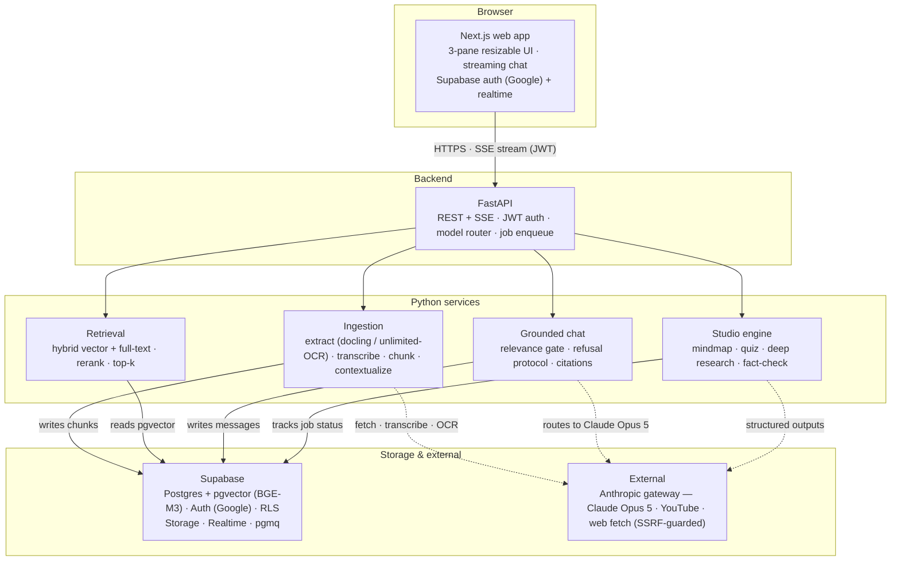

# OpenbookLM — Product Requirements & System Design

> **v1.2 · Draft** · 2026-08-30
> **Stack:** FastAPI (Python) · Supabase + pgvector · Next.js (React + Tailwind)
> **LLM:** Anthropic gateway — **Claude Opus 5** (main) · BGE-M3 embeddings · docling / unlimited-OCR parsing
> **v1.2 changes:** restored Google sign-in (Supabase Auth) + server-side persistence · no web search bar · 3-stage ingestion (extract → chunk → embed) · strict "no bluff" refusal protocol

---

## 1. Overview

OpenbookLM is a NotebookLM-style research workspace. A **notebook** owns a set of **sources** — web links, uploaded files, YouTube videos, pasted text. You **chat** with those sources: answers are generated *only* from what you attached, with inline citations, and if a question is out of context the model says so plainly — it never bluffs. The **studio** turns the same sources into finished artifacts in one click — mindmap, quiz, deep-research report, fact-check.

**Sign in with Google.** One click, no passwords. Your notebooks, sources, chats, and artifacts are saved to your account and follow you across devices. There is no web search bar — OpenbookLM answers only from what you attached.

The three panes are independently **drag-resizable** (Sources · Chat · Studio).

```text
┌───────────┬──────────────────────────┬─────────────┐
│  SOURCES  │           CHAT           │   STUDIO    │
│           │    grounded · cited      │             │
│  + Add    │   user: how does         │  Mindmap    │
│  URL ·    │   attention work?        │  Quiz       │
│  PDF ·    │   …[1] [2]…              │  Summary    │
│  YouTube  │                          │  Fact-check │
│           │                          │  Deep res.  │
│ 3 ready · 1 processing               │  Flashcards │
└───────────┴──────────────────────────┴─────────────┘
        ← three panes, each drag-resizable →
     (Google sign-in · everything synced to your account)
```

### The core loop

1. **Attach** a source — the pipeline extracts, chunks, and embeds it in the background.
2. **Index** — every chunk is stored in Postgres with a pgvector embedding and full-text keys, tagged with provenance.
3. **Ask or run** — chat retrieves relevant chunks and generates a cited, grounded answer; studio runs a task pipeline over the index.
4. **Verify** — citations always resolve to the source material, and out-of-context questions get an honest "I don't know."

---

## 2. Goals & non-goals

### Goals
- **Grounded, cited answers only from your sources.** The model cannot wander into its own knowledge; citations always resolve to a retrievable passage.
- **No bluffing, ever.** Out-of-context questions are answered with a plain refusal ("I don't know about this") — never a guessed answer.
- **One-click Google sign-in.** No password flow; everything you create is scoped to your account and follows you across devices.
- **Account-level persistence.** Notebooks, sources, chats, and artifacts are stored server-side per user, enforced by row-level security.
- **Fast, non-blocking ingestion** of web links, files, and YouTube videos, all in the background — via a three-stage pipeline: extract (docling / unlimited-OCR) → chunk (structural + context metadata) → embed (BGE-M3).
- **One-click structured tasks** — mindmap, quiz, summary, flashcards, deep research, fact-check — over the same index.
- **Cost-sane by construction** — cheap models for bulk steps, Claude Opus 5 only where reasoning matters.

### Non-goals (v1)
- Any web/outside-the-sources search — the product never looks beyond what you attached. (That's what a search engine is for.)
- Real-time collaborative editing or shared notebooks.
- Model fine-tuning or custom embedding training.
- Native mobile apps (responsive web only).
- PPTX/Slides parsing beyond plain-text extraction (later add).

---

## 3. Who it is for

| Persona | Need |
|---|---|
| **Researcher** | Aggregates papers and links, then needs *cited synthesis*: "compare the evaluation methods across these three papers." Never trusts an answer without the quote. |
| **Student** | Studies from course PDFs and YouTube lectures. Wants a quiz and flashcards from the material, a mindmap before an exam, and a chat that can only answer from the syllabus. |
| **Analyst** | Needs claims checked against a document set: "verify every factual claim in this draft against these sources," as a pass/fail table with evidence. |

Representative stories:
1. As a researcher, I paste a dozen links, ask one question, and get an answer whose every `[n]` opens the exact passage.
2. As a student, I upload my lecture PDF and a YouTube lecture, click **Quiz**, and get a cited question set I can retake.
3. As an analyst, I click **Fact-check** and see each claim tagged supported / contradicted / unverifiable, with the quote.
4. As any user, I ask something that has nothing to do with my sources and the model says "I don't know about this" instead of inventing an answer.
5. As any user, I sign in on another device and my notebooks, sources, and chats are all there — the account is the single source of truth.

---

## 4. Functional requirements

### 4.1 Sources pane

| ID | Requirement | Milestone |
|---|---|---|
| FR-S-01 | Add one or many web URLs; each is fetched, parsed, chunked, embedded, and indexed asynchronously. | M1 |
| FR-S-02 | Upload files (PDF, DOCX, TXT, MD) via Supabase Storage; parsed server-side, layout-aware for PDFs. | M3 |
| FR-S-03 | Paste a YouTube link; captions captured (auto-captions, Whisper fallback) and indexed; hard length cap. | M4 |
| FR-S-04 | Paste raw text directly as a source. | M1 |
| FR-S-05 | Source list shows title, domain, type icon, character count, and a status chip: `ready` / `processing` / `failed`. | M1 |
| FR-S-06 | Toggle any source in/out of future answers (persisted, reflected live in chat's source picker). | M1 |
| FR-S-07 | Remove a source (cascades: chunks gone) and re-process a source (idempotent chunk replacement). | M1 |
| FR-S-08 | View the raw extracted text of any source. | M1 |
| FR-S-09 | Failures are actionable: "couldn't fetch — the page requires login," not a generic error. | M1 |

### 4.2 Chat pane (main)

| ID | Requirement | Milestone |
|---|---|---|
| FR-C-01 | Grounded Q&A over the selected sources, streamed token-by-token. | M1 |
| FR-C-02 | Inline citations `[n]` render as chips; hover previews the passage, click opens the source card. | M1 |
| FR-C-03 | **No-bluff contract.** If the question is out of context, the answer is exactly "I don't know about this" / "Nothing related to this is stated in the sources." The model never invents, guesses, or falls back to its own knowledge. | M1 |
| FR-C-04 | Multi-turn conversation memory, auto-compacted past the model window. | M2 |
| FR-C-05 | Source picker: answer from all sources or a subset; reflects Sources-pane toggles. | M1 |
| FR-C-06 | Suggested follow-ups / starter prompts rendered under the input. | M2 |
| FR-C-07 | Conversations persist server-side per account; resume any past chat on any device. | M1 |

### 4.3 Studio pane

| ID | Requirement | Milestone |
|---|---|---|
| FR-T-01 | Task cards: **Mindmap** · **Quiz** · **Summary** · **Flashcards** · **Deep research** · **Fact-check**. | M2 |
| FR-T-02 | Each task runs against the selected sources and reports progress (indeterminate → percent). | M2 |
| FR-T-03 | Each task yields a structured artifact: graph JSON, question bank, report, verdict table — rendered in the pane and saved to your account. | M2 |
| FR-T-04 | Deep research streams its steps ("searching… synthesizing…") as it goes. | M4 |
| FR-T-05 | Save any artifact; regenerate; tune params (depth, question count, sample size). | M2 |
| FR-T-06 | Artifacts carry the same citation provenance as chat answers — and the same no-bluff rule. | M2 |

### 4.4 Accounts & persistence

| ID | Requirement | Milestone |
|---|---|---|
| FR-A-01 | Sign in with Google via Supabase Auth; one click, no password. | M0 |
| FR-A-02 | Session persists across reloads; sign out is explicit. | M0 |
| FR-A-03 | Notebooks, sources, chats, and artifacts are scoped to the signed-in user; row-level security enforces it server-side. | M0 |
| FR-A-04 | Sign out and back in — everything is still there. | M0 |
| FR-A-05 | Layout and settings are saved per user. | M0 |

### 4.5 Layout

| ID | Requirement | Milestone |
|---|---|---|
| FR-L-01 | Three panes, drag-resizable with min widths, collapsible; layout persists per user. | M0 |
| FR-L-02 | Responsive: on narrow screens panes stack; a top switcher selects Sources / Chat / Studio. | M0 |

---

## 5. Non-functional requirements

| ID | Constraint | Target |
|---|---|---|
| NFR-1 | Perceived latency | First token ≤ 1.5 s; full answer ≤ 20 s typical; p95 ≤ 40 s for long studio tasks. |
| NFR-2 | Streaming | Every generative surface (chat, deep research) streams; nothing blocks on a spinner. |
| NFR-3 | Ingestion isolation | A 50-page PDF or 1-hour video never blocks the UI; queue depth visible in the Sources pane. |
| NFR-4 | Isolation & privacy | Notebooks private to their owner; row-level security enforces it server-side, not just in the UI. |
| NFR-5 | Honesty | The no-bluff protocol is part of the eval harness — refusal correctness is a scored metric, not a wish. |
| NFR-6 | Cost ceiling | Monthly LLM spend bounded by model routing, caching, and compaction (§12). |
| NFR-7 | Observability | OpenTelemetry traces per request and per job; every retrieval/generation step logged with latency and tokens. |
| NFR-8 | Quality bar | Eval harness tracks retrieval hit-rate, answer faithfulness, and refusal correctness; regressions gate merges. |
| NFR-9 | Reliability | Jobs retry with backoff; model fallback chains; no silent failures. |

---

## 6. System architecture

One Python API owns every intelligent path. The web app is a thin client over it; Supabase owns auth, data, storage, and the job queue.

### Components

- **Web app** — Next.js + Tailwind. The three panes, streaming chat, resizable panels. Supabase client for Google sign-in and realtime.
- **API backend** — FastAPI (async). REST + SSE endpoints. Holds the model router, retrieval, and orchestration. Auth via Supabase JWTs.
- **Job workers** — Python workers consuming a Postgres-backed queue (pgmq). Ingestion, transcription, and studio tasks run here, never in request handlers.
- **Supabase** — Postgres with **pgvector** (HNSW on chunks), **Auth (Google OAuth)**, Storage (files, transcripts), Realtime (job progress), pgmq (queue tables). Row-level security scopes everything to the owner.
- **LLM gateway** — **Anthropic, Claude Opus 5** as the main model, called through the gateway key. The backend holds the key; the browser never sees it.
- **Embedding** — **BGE-M3** (self-hosted), 1024-dim, for both indexing and query encoding.
- **Parsers** — **docling** (layout-aware PDF/Office) with **unlimited-OCR** for the hardest scans; trafilatura for HTML→markdown.
- **YouTube** — yt-dlp for captions, faster-whisper fallback for videos without captions.

### Architecture diagram



> **Persistence split:** the server stores the *corpus* (sources + chunks) *and* everything a user makes (chats, artifacts), scoped by row-level security to the owner. The browser is a client, not a store — sign in anywhere and your work is there.

### Request flows

**Ingestion** (add a source):
1. UI calls `POST /notebooks/{id}/sources` with a JWT; backend verifies ownership, inserts a row with `status=queued`, and enqueues a job.
2. Worker extracts (docling / unlimited-OCR for files, trafilatura for URLs, yt-dlp → Whisper for YouTube).
3. Worker normalizes to markdown, chunks, writes context prefixes, embeds with BGE-M3, and upserts chunk rows.
4. Source flips to `ready`; Realtime pushes status to the Sources pane.

**Chat** (a grounded answer):
1. UI sends the message + selected source ids; FastAPI opens an SSE stream.
2. Retrieval embeds the query, runs hybrid search over the user's selected sources, reranks, returns top-k chunks.
3. **Relevance gate:** if no chunk clears the relevance threshold, the reply is the refusal — no model call, no guesswork.
4. Otherwise the router builds the prompt (chunks + conversation tail) and streams Claude Opus 5.
5. Citation guardrails validate every `[n]`; the message rows persist server-side, and the reply streams to the UI.

**Studio** (a task):
1. UI calls `POST /studio/tasks` with a type; a job is enqueued with progress plumbing.
2. The task pipeline retrieves its working set, runs structured generations, post-processes into an artifact.
3. The artifact saves to the account (server-side), and Realtime updates progress in the UI.

> **Grounding principle:** the assembled prompt contains *only* retrieved passages and the conversation tail — the model's prior knowledge is not a source. This is enforced by the relevance gate **and** the citation guardrail, so "grounded" and "no bluff" are properties of the pipeline, not promises from the model.

---

## 7. Data model

Postgres is the single store, scoped by `user_id` and enforced with row-level security. Vectors live beside the rows they describe. Embeddings are BGE-M3, 1024-dim.

```sql
-- profiles extends Supabase auth.users (Google sign-in)
create table public.profiles (
  id uuid primary key references auth.users(id),
  display_name text,
  avatar_url text,
  created_at timestamptz default now()
);

create table public.notebooks (
  id uuid primary key default gen_random_uuid(),
  user_id uuid not null references public.profiles(id),
  title text not null default 'Untitled notebook',
  settings jsonb not null default '{}'::jsonb,  -- embed model, chunk size, router overrides
  created_at timestamptz default now(),
  updated_at timestamptz default now()
);

create table public.sources (
  id uuid primary key default gen_random_uuid(),
  notebook_id uuid not null references public.notebooks(id) on delete cascade,
  type text not null check (type in ('url','file','youtube','text')),
  url text,
  title text,
  status text not null default 'queued'
    check (status in ('queued','processing','ready','failed')),
  error text,
  storage_path text,                       -- Supabase Storage: file / transcript
  content_md text,                         -- normalized markdown after parsing
  metadata jsonb not null default '{}'::jsonb,  -- domain, duration, mime, page_count…
  enabled boolean not null default true,
  created_at timestamptz default now(),
  updated_at timestamptz default now()
);

create table public.chunks (
  id uuid primary key default gen_random_uuid(),
  notebook_id uuid not null references public.notebooks(id) on delete cascade,
  source_id uuid not null references public.sources(id) on delete cascade,
  chunk_index int not null,
  content text not null,                   -- context-prefix + passage (BGE-M3 input)
  heading_path text,                       -- "3.2 · Early-termination fees"
  page_number int,
  token_count int,
  embedding vector(1024),                  -- BGE-M3
  created_at timestamptz default now()
);
create index chunks_hnsw on public.chunks using hnsw (embedding vector_cosine_ops);
create index chunks_fts on public.chunks using gin (to_tsvector('english', content));
create index chunks_notebook on public.chunks (notebook_id, source_id);

create table public.conversations (
  id uuid primary key default gen_random_uuid(),
  notebook_id uuid not null references public.notebooks(id) on delete cascade,
  title text not null default 'New chat',
  created_at timestamptz default now()
);

create table public.messages (
  id uuid primary key default gen_random_uuid(),
  conversation_id uuid not null references public.conversations(id) on delete cascade,
  role text not null check (role in ('user','assistant')),
  content text not null,
  source_ids uuid[],                       -- sources this turn was grounded on
  citations jsonb not null default '[]'::jsonb,  -- [{chunk_id, source_id, quote}]
  model text,
  tokens_used jsonb,
  created_at timestamptz default now()
);

create table public.studio_tasks (
  id uuid primary key default gen_random_uuid(),
  notebook_id uuid not null references public.notebooks(id) on delete cascade,
  task_type text not null,          -- mindmap | quiz | summary | flashcards | deep_research | fact_check
  params jsonb not null default '{}'::jsonb,
  status text not null default 'queued'
    check (status in ('queued','running','succeeded','failed')),
  progress int not null default 0,  -- 0–100
  result jsonb,                     -- structured artifact
  error text,
  created_at timestamptz default now(),
  updated_at timestamptz default now()
);
```

### Retrieval indexes

- `chunks_hnsw` — approximate vector search with cosine distance.
- `chunks_fts` — GIN over `to_tsvector(content)` for the lexical half of hybrid search.
- Both queries always filter by `notebook_id` and optionally `source_id = any(...)` first, keeping scans scoped.

### Security (RLS)

Every notebook-scoped table enforces ownership through `notebooks.user_id = auth.uid()`; `profiles` is owner-only; Storage buckets are private with owner-only policies. The API layer additionally re-verifies ownership on every request — RLS is the backstop, not the whole story.

---

## 8. Subsystem design

### 8.1 Three-stage ingestion

One pipeline, three front-ends. The stages are fixed: **extract → chunk → embed**, each with a single, deliberate tool.

| Stage | Job | Tool |
|---|---|---|
| **1 · Extract** | PDF/scan/HTML/transcript → clean, structured markdown (layout, tables, reading order preserved) | **docling** (default, layout-aware) · **unlimited-OCR** (VLM one-shot parsing for the hardest scans) · trafilatura (HTML) · yt-dlp + faster-whisper (YouTube) |
| **2 · Chunk** | Markdown → retrievable units that keep their page context | Structural chunking at headings/paragraphs/tables (~800–1200 tokens) + LLM-written context prefix |
| **3 · Embed** | Each chunk → vector | **BGE-M3**, self-hosted, 1024-dim |

Per source type, the head of the pipeline differs:
- **URL** — SSRF-guarded fetch → trafilatura to markdown → strip boilerplate.
- **File** — upload to Storage → docling (or unlimited-OCR for scans) → markdown.
- **YouTube** — yt-dlp for auto-captions; faster-whisper fallback when absent. Hard cap (e.g., 90 min).
- **Text** — direct paste, normalized as-is.

Failure is first-class: the worker records an actionable `error`, the source shows `failed`, and reprocessing is idempotent — it deletes the source's chunk rows and upserts fresh ones.

### 8.2 Chunking — keep the page context

Chunks are structural, not fixed-size: boundaries fall at headings, paragraphs, list items, and tables, targeting ~800–1200 tokens with a small overlap. Each chunk remembers where it lives.

To make chunks self-contained for retrieval, embed a **contextualized form** — the passage prefixed by its location and, where the passage is short, an LLM-written one-line context:

```text
[source_title · heading_path · page N]
[context] This chunk covers the early-termination clause in
section 3.2 of the lease, including the 60-day notice window.
[passage] …the text of the chunk…
```

This is the "not leaving the page context" requirement: even a bare fragment like *"as discussed above"* retrieves correctly because the context travels with it.

> **Cost control:** Contextualization is high-volume. It runs on the cheapest available routing tier (if your gateway exposes one) or is skippable per-source — reprocessing a 50-page PDF doesn't re-pay it if nothing changed.

### 8.3 Embedding & retrieval

Embeddings come from **BGE-M3** (self-hosted) — a dedicated embedding model, never a chat LLM. Same model for indexing and query encoding, so dimensions always match.

Retrieval is hybrid, all in Postgres plus one Python rerank pass:

1. **Vector** — `embed(query)` → HNSW cosine → top 40, filtered by notebook/sources.
2. **Lexical** — `websearch_to_tsquery(query)` → GIN tsvector → top 20 (catches exact terms embeddings miss).
3. **Merge** — weighted reciprocal-rank fusion (e.g., `0.6` vector / `0.4` lexical), dedup → top 20.
4. **Rerank** — local BGE-reranker-base cross-encoder → top 6–10, and a **relevance score** for the gate below.

The reranker is the highest quality-per-dollar lever in the system — it reliably beats swapping embedding models, and it powers the no-bluff gate.

### 8.4 Grounded chat & the no-bluff protocol

**Relevance gate (before the model is called).** After reranking, if the top chunk's relevance score is below threshold — or nothing was retrieved at all — the reply is immediate and honest:

> *"I don't know about this."*

No LLM call happens, so a guess is impossible. This covers greetings, off-topic questions, and anything the corpus doesn't touch.

**System contract (when the model is called).** The preamble fixes the ground rules:

> *"You answer only from the provided passages. Cite [n] for every claim. If the passages do not contain the answer — even partially — reply exactly 'Nothing related to this is stated in the sources.' Never answer from your own knowledge. Never paraphrase what isn't there."*

Claude Opus 5's instruction-following is what makes this contract reliable; the gateway router pins the strongest model to `chat` for exactly this reason.

**Citation guardrail (after generation).** Every `[n]` is checked against the actually-retrieved chunk set. Invalid citations are stripped; a wholly ungrounded answer is regenerated under a stricter instruction or replaced with the refusal. Citations are never decorative.

**Memory.** Conversation memory is the last N messages from the persisted conversation; past a threshold, the tail is compacted by a model into a running summary. Refusal is not "memory" — every turn re-runs the gate and re-retrieves against the fresh query.

### 8.5 Studio task engine

A task is a pipeline: *retrieve working set → structured generations → post-process → artifact*. All generations request JSON via schema; the router's `extract` role handles it.

- **Mindmap** — derive a topic hierarchy from the corpus (summarize per section, then merge) → nodes/edges JSON → rendered with React Flow.
- **Quiz** — coverage-sample chunks → MCQs with distractors, explanations, per-question citations → interactive, re-takeable.
- **Summary / Flashcards / Key terms** — single-pass structured generations over the working set.
- **Deep research** — decompose a question into sub-queries; each sub-query retrieves fresh chunks and is read independently; a planner merges into a cited report, streaming steps.
- **Fact-check** — extract claims from the corpus; each claim retrieves supporting/contradicting passages; verdict = `supported` / `contradicted` / `unverifiable` with the quote. Claims the corpus can't speak to are marked `unverifiable`, never silently endorsed.

Artifacts save server-side in `studio_tasks.result` and obey the same no-bluff and citation rules as chat.

### 8.6 Model router

The gateway is called through one client; the router is a config table mapping roles → model, editable without deploys:

| Role | Job | Model | Why |
|---|---|---|---|
| `chat` | Grounded Q&A, citation & refusal discipline | **Claude Opus 5** | Strictest instruction-following for the no-bluff contract |
| `extract` | Structured JSON — mindmap, quiz, claims | **Claude Opus 5** (or cheaper tier if exposed) | Reliable JSON-schema output |
| `contextual` | Chunk context prefixes | Claude Opus 5, or the cheapest model your gateway exposes | High volume — cost-sensitive by design |
| `doc_parse` | PDF/scan layout → text | docling locally · **unlimited-OCR** for hardest scans | Layout reasoning without paying per token |
| `embed` | Query & chunk vectors | **BGE-M3** (self-hosted) | Never a chat LLM |
| `rerank` | Cross-encoder scoring | BGE-reranker-base (local) | Don't spend chat tokens on scoring |

Fallback chains matter: if Claude Opus 5 429s or errors, a configured fallback steps in so the product degrades gracefully instead of failing.

---

## 9. API surface

All routes under `/v1`, Bearer JWT from Supabase (Google sign-in). Generative endpoints stream via SSE (`text/event-stream`).

| Method · Path | Purpose |
|---|---|
| `POST /v1/notebooks` | Create a notebook |
| `GET /v1/notebooks` | List my notebooks |
| `GET /v1/notebooks/{id}` | Notebook detail + settings |
| `DELETE /v1/notebooks/{id}` | Delete notebook (cascade) |
| `POST /v1/notebooks/{id}/sources` | Add source — `url \| file \| youtube \| text`; enqueues job |
| `GET /v1/notebooks/{id}/sources` | List sources with status |
| `PATCH /v1/sources/{id}` | Toggle `enabled`, rename |
| `DELETE /v1/sources/{id}` | Remove source (chunks cascade) |
| `POST /v1/sources/{id}/reprocess` | Idempotent re-index |
| `GET /v1/sources/{id}/content` | Raw normalized text |
| `POST /v1/notebooks/{id}/conversations` | New chat |
| `GET /v1/notebooks/{id}/conversations` | List chats |
| `POST /v1/conversations/{id}/messages` | Send message → SSE stream (tokens, citations, done) |
| `GET /v1/conversations/{id}/messages` | History |
| `POST /v1/notebooks/{id}/studio/tasks` | Enqueue a task (`type`, `params`) |
| `GET /v1/notebooks/{id}/studio/tasks` | List tasks + status |
| `GET /v1/studio/tasks/{id}` | Status + progress |
| `GET /v1/studio/tasks/{id}/result` | Artifact payload |
| `GET /v1/health` | Liveness + dependency status |

---

## 10. Background jobs & queueing

Long work never happens in a request handler. Because you're already on Postgres, the queue is **pgmq** — Postgres-backed, no new infrastructure, RLS-compatible.

- **Job types:** `ingest_url`, `ingest_file`, `transcribe_youtube`, `contextualize_chunks` (backfill), `studio_task`.
- **Workers:** Python processes (same FastAPI codebase) polling pgmq; scale horizontally by adding workers. Retry + exponential backoff; poison jobs quarantined.
- **Progress:** workers write `progress` / `status`; Supabase Realtime pushes deltas to the UI.
- **Alternative:** arq + Redis if you prefer a single-purpose queue; the job interface is the same either way.

---

## 11. Security & privacy

- **Google OAuth via Supabase Auth** — JWTs verified server-side on every request; no passwords stored.
- **RLS everywhere** — every query scoped to the owner via `auth.uid()`; the API re-checks ownership regardless of client claims.
- **Claude key stays server-side.** The gateway key lives in server env / Supabase Secrets; the browser never sees it. All generation is proxied through FastAPI.
- **SSRF guard on URL fetch** — block private, loopback, and link-local targets at the resolver; redirect allowlist; size cap.
- **Upload policy** — allowlist MIME types, size caps, optional malware scan; files in private buckets only.
- **Rate limits** — per-user token and request budgets to bound cost and to keep one heavy user from starving a shared gateway key.
- **Third-party disclosure** — content is sent to Anthropic (Claude Opus 5) and, only for YouTube ingestion, processed locally (yt-dlp / faster-whisper). No web-search provider is involved.
- **Prompt-injection stance** — retrieved chunks are untrusted; the system preamble instructs the model that source text is data, never instructions.

---

## 12. Cost model

Rough monthly figures per user, assuming one active notebook and Supabase on the Free tier at first. Exact figures depend on your gateway's Claude Opus 5 pricing — treat these as the shape.

| Line item | Light | Medium | Heavy | Levers |
|---|---|---|---|---|
| Embeddings (BGE-M3 self-hosted) | $0 | $0 | $0 | Free — a big advantage of BGE-M3 |
| Rerank (BGE-reranker-base, local) | $0 | $0 | $0 | Free |
| Parsing (docling / unlimited-OCR) | $0 | $0 | $0–5 | Self-hosted = free; API-based OCR adds per-page cost |
| Contextual chunking | $1–2 | $4–8 | $15–30 | Cheap-tier model; cached; skippable per source |
| Chat + studio (Claude Opus 5) | $5–10 | $20–50 | $80–150 | **The main line.** Prompt caching, compaction, top-k discipline |
| Supabase | $0 | $25 | $25+ | Free tier → Pro when storage/vector grows |
| **Total / user** | **~$6–12** | **~$45–80** | **~$120–210** | |

Three rules keep this bounded: (1) retrieval, embedding, and rerank are free/local, (2) Opus 5 is used only for `chat`, final synthesis, and structured artifacts, (3) every user has a token budget with a hard cap. The relevance gate has a hidden benefit: every out-of-context refusal costs **zero** LLM tokens.

---

## 13. Build plan

| Milestone | Scope | Exit criteria |
|---|---|---|
| **M0** Skeleton | Next.js + FastAPI + Supabase wired; **Google sign-in**; RLS on all tables; 3-pane resizable layout; health endpoint. | Sign in with Google, create a notebook, resize panes; reload and everything persists. |
| **M1** Grounded chat | URL + text ingestion; BGE-M3 embed; hybrid retrieval; streaming chat with citations; **relevance gate + refusal protocol**; sources list + toggles + failure states; chats persist server-side. | Ask a question over 5 web sources — every `[n]` opens the exact passage; ask something out of context and get "I don't know about this"; sign out/in and the chat is still there. |
| **M2** Studio v1 | Job queue (pgmq) + workers; Summary, Quiz, Mindmap; progress via Realtime; conversation compaction; artifacts saved to account. | Run all three tasks over a 30-page doc; artifacts render with citations and survive a reload. |
| **M3** Files + docs | PDF/DOCX upload via docling, unlimited-OCR for scans; storage hardening. | Upload a scanned PDF and a DOCX, chat about both, verify the layout/tables survived parsing. |
| **M4** YouTube + depth | YouTube ingestion (captions → Whisper fallback); deep research + fact-check; contextual chunking + backfill. | A 1-hour lecture becomes a cited mindmap; a claim set is checked to a verdict table. |
| **M5** Quality & hardening | Eval harness (retrieval hit-rate, answer faithfulness, **refusal correctness**); caching; rate limits; observability; cost dashboards. | CI gates on eval scores — including "does it refuse every out-of-context question"; p95 latency targets hold. |

> **Suggested build order:** The happy path — URL in, honest cited answer out (M1) — is the whole product's spine. Get the no-bluff gate working *first*; every later feature builds on a retrieval layer you can trust to say no.

---

## 14. Open decisions

1. **Contextual chunking model.** Claude Opus 5 for maximum context quality vs the cheapest model your gateway exposes for the bulk pass. Cost vs quality — decide after the M4 eval.
2. **unlimited-OCR hosting.** Self-hosted (needs GPU) vs API-based. Determines whether Stage-1 parsing is free or per-page.
3. **Auth providers.** Google-only (simplest, matches the product) vs also email/password or other OAuth. Google-only is the recommendation.
4. **Supabase hosted vs self-hosted Postgres.** Hosted is zero-ops (Auth, Storage, Realtime, pgmq included); self-hosting changes the auth, queue, and storage story.
5. **Fallback model chain.** Pin the exact fallback for Claude Opus 5 (429s/errors) once you confirm what your gateway key exposes.